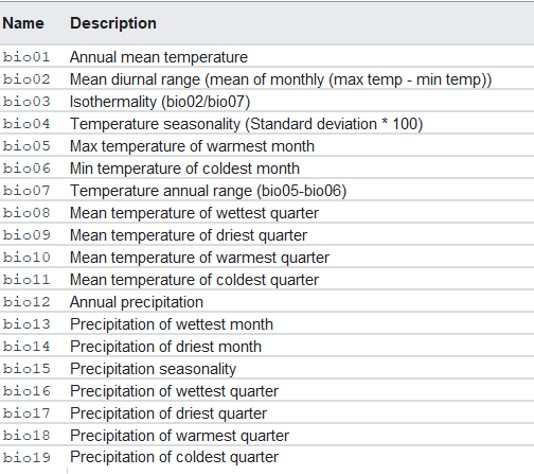
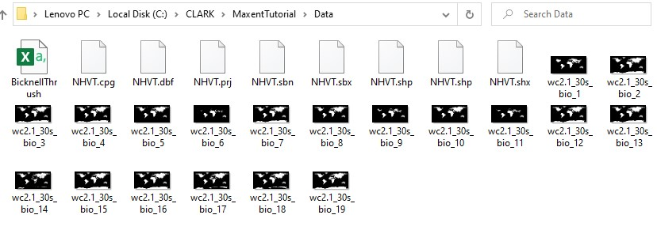
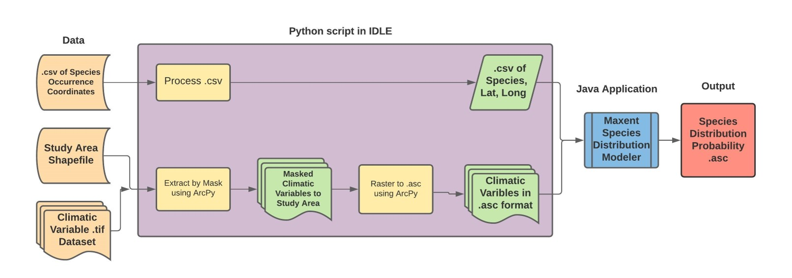
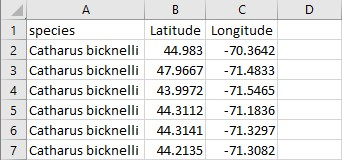
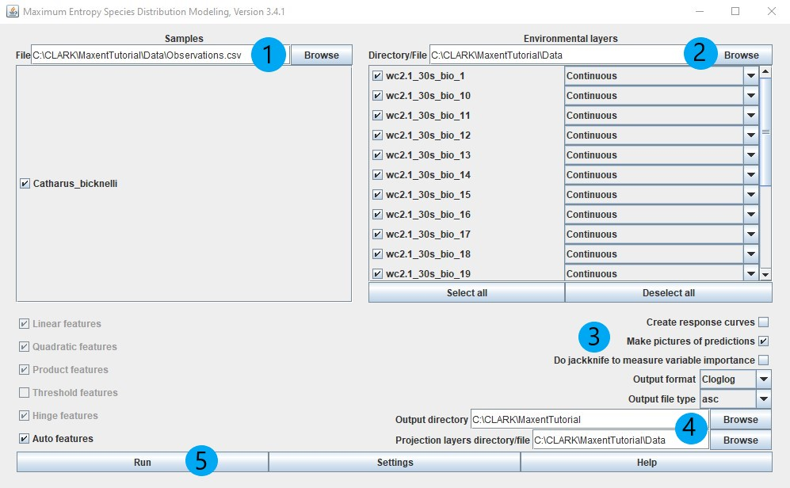

# Species Distribution Modeling of Bicknell's Thrush in VT and NH using Maxent
### A Tutorial for Data Preparation | Mitchell Lazarz | 07 December 2020 | ID30274 Final Project

This repo contains this README explaining the steps for data preparation for the Maxent software for modeling species niche and and distribution.  This README will walk the user through the steps of software download, data download, local drive preparation, the python script for data preparation, running of the Maxent software, as well as a short analysis of outputs.  The .py script and species occurrence and study area mask data used in this tutorial are contained in this repo.

## What is Maxent?  And why use Maxent?

[Maxent](https://biodiversityinformatics.amnh.org/open_source/maxent/) is an open-source software that utilizes a machine learning algorithm in order to model species distribution based on species occurrence records and a set of climate variables.  The software extracts values at species occurrence coordinates from the series of climate grids and projects the distribution by comparing to a set of randomly selected points used as psedo-absense records.  The algorithm is based on the maximum entropy theory that estimates the greatest probability based on our current understanding of the distribution and attributes of our input records.  More information about the statistics behind this software can be found here [(Elith et. al 2010).](https://web.stanford.edu/~hastie/Papers/maxent_explained.pdf)  The Maxent approach of species distribution modeling is a widely accepted method in the ecological modeling community.  As of 2006, the Maxent software has been cited over [6000 times](https://onlinelibrary.wiley.com/doi/full/10.1111/ecog.03049) for use in ecological studies in Google Scholar (Philips et. al 2017).

The Maxent software is beneficial for conservation and land management agencies with a limited budget.  Because Maxent is open-source, it is available generally for use by the public for no cost.  This software also is relatively simple to use and the output report gives clear explanations of the findings of the model.  Because it is so widely used, there are many additional resources for result interpretation.  A set of resources from the creator, Robert Anderson, can be found [here.](https://www.andersonlab.ccny.cuny.edu/resources)

## Tutorial Summary


In this tutorial, we will be modeling the species distribution of the Bicknell's Thrush (*Catharus bicknelli*) in Vermont and New Hampshire using species occurrence records from 2010 to 2019 and climate information from 1970 to 2000.  The [Bicknell's Thrush](https://vtecostudies.org/wildlife/birds/mountain-birds/bicknells-thrush-2/) is one of the rarest songbird in the Eastern United States with a severe population vulnerability due to habitat loss from development and climate related factors.  We will be modeling distribution of the Bicknell's Thrush in Vermont and New Hampshire as it's summer breeding ground in is the high elevation boreal forests of the White Mountains and Green Mountains where Bicknell's Thrush habitat conservation is a priority.

## Software Needed

In this tutorial, the user will need: 
1. Maxent species modeler application 
2. A Python IDLE (I used [IDLE (Python GUI) 3.9.0](https://www.python.org/downloads/)) 
3. ArcGIS Map or Pro with spatial analyst extension

To download Maxent, go to [this site](https://biodiversityinformatics.amnh.org/open_source/maxent/) and download the latest version.  Unzip folder contents onto your computers hard drive; I unzipped to my Program Files.  To open the Maxent modeler (you do not need to do this now), open the maxent executable .jar file within the folder.

## Data

In this tutorial we will be using three sets of data:
1. A .csv of species occurrence records
2. A study area mask
3. A set of climate variables downloaded as GEOTIFFs

#### Species Occurrence .csv
Found in this repo is a .csv of Bicknell's Thrush sightings from 2010 to 2019.  This .csv was accessed from the [Global Biodiversity Information Facility](https://www.gbif.org/).  This database contains species records from over 54,000 species.  If you would like to model distribution for a different species in the future, GBIF.org has a [user-friendly interface](https://www.gbif.org/occurrence/search) for querying for your species of interest and timeframe.  The .csv within this repo is a raw dataset that contains over 40 fields.

#### Study Area Mask
Within the StudyAreaMask folder in this repo is a shapefile of Vermont and New Hampshire, our area of interest.  This shapefile was accessed from [TIGER U.S. Census States, 2018](https://www.census.gov/geographies/mapping-files/time-series/geo/tiger-line-file.html).   

#### Climate Variables
The set of climate varibles used in this tutorial are the WorldClim Bio Variables Version 2.1.  This is a set of 19 historic bioclimatic variables ranging from average/minimum/maximum temperature, annual/monthly/quarterly precipitation, and seasonal weather variables.  These variables are downloaded in GEOTIFF format.  A list of these variables can be seen below:



To access this dataset, go to the [WorldClim website download page](https://www.worldclim.org/data/worldclim21.html).  Within the table containing "Bioclimatic variables", select bio30s or click [here](https://biogeo.ucdavis.edu/data/worldclim/v2.1/base/wc2.1_30s_bio.zip) to download.  This is at a 30 second spatial resolution and the folder is 9.68 GB.  If you would like to try this tutorial using a smaller dataset with a larger spatial resolution, one can use the bio 10 minute or bio 5 minute datasets. 

## Getting Started

First we must set up our data folder with all data needed in this tutorial.  Create a "Data" folder and download/unzip the BicknellThrush.csv, NHVT shapefile files, and WorldClim GEOTIFFs to this folder.  Your Data folder environment should look something like this:



## Data Manipulation Python Code

Next, open your Python IDLE to beginning writing code to do two operations:
1. Manipulate the input .csv to have three fields:  Species, Latitude, and Longitude
2. Mask the bioclimatic GEOTIFFs to our NHVT shapefile study area and convert the masked varibles from GEOTIFF to .asc format.

You may want reference the .py script within this repo to see this process.  The following is the workflow of the entire process and the following sections will walk you through this flow step by step:



### Cleaning the BicknellThrush.csv

The Maxent software only allows for a input of species occurrence records with the three fields mentioned earlier.  We will write a script to convert the raw .csv to a .csv containing three fields.

First, the csv module is imported.
```
# import csv module
import csv
```
Next, the BicknellThrush.csv is opened and assigned to a variable, Bicknell_Thrush.
```
# open and assign raw .csv file to variable
Bicknell_Thrush=open('C:\CLARK\MaxentTutorial\Data\BicknellThrush.csv')
```
Then, we create a file location for the output .csv. Here we choose the same Data folder for our output and name the new .csv with three fields, Observations.csv.
```
# create writable file location for output .csv
outputFile=open('C:\CLARK\MaxentTutorial\Data\Observations.csv','w')
```
Lastly, a *for loop* is created which, for each row in our input .csv, splits the fields in an occurrence of a tab.  The fields for species, latitude and longitude are assigned to variables and then are renamed.  The output is then written to our output .csv file location.
```
# for loop which creates a .csv with three columns, Species, Latitude, Longitude
for row in Bicknell_Thrush:
  obs=row.split('\t')
  species=obs[9]
  lat=obs[21]
  lon=obs[22]
  lat=lat.replace('decimalLatitude','Latitude')
  lon=lon.replace('decimalLongitude','Longitude')
  outputFile.write(species+', '+lat+', '+lon+'\n')
```
We can see by opening our output .csv, Observations.csv, that we now have a file with only three fields, species, latitude, and longitude.


### Masking and converting the Bioclimatic variables to .asc format

In order to analyze on a scale that only incorporates Vermont and New Hampshire rather than at a global scale we must mask our climate variables to the NHVT shapefile.  Additionally, the Maxent software does not read the GEOTIFF format, but rather the text based ASCII (.asc) format.  After masking, we will convert the GEOTIFFs to .asc.

First we must import all of the modules needed for this operation.  These include arcpy, the spatial analyst extension of arcpy, and the operating system interface (os).
```
# import arcpy module, workspace environment, and spatial analyst extension
import arcpy
from arcpy import env
from arcpy.sa import *

# import operating system module
import os
```
Next, we will organize the names of GEOTIFF files within the Data folder into a list.  We do this in order to easily call and loop through the 19 .tif files with ease during our masking and .asc conversion operations.  An empty list, ClimateVariableList, to hold our file names is created and the Data folder is looped through, taking the file name of each climate .tif and adding it to the empty list.  We can then print the ClimateVariableList to ensure that it contains 19 elements.
```
# create empty list for climate file names
ClimateVariableList=[]

# loops through climate folder and adds file name to empty list
ClimateFolder = r'C:\\CLARK\\MaxentTutorial\\Data\\'
for filename in os.listdir(ClimateFolder):
    if filename.endswith(".tif"):
        ClimateVariableList.append(filename)
print(ClimateVariableList)
```
We then set the workspace environment to our Data folder, set the overwrite priveleges as True (we want only one climate .asc for each variable when we run Maxent), and check out the spatial analyst extension.
```
# Set environment settings to folder with climate data and allow for overwriting
env.workspace = 'C:\\CLARK\\MaxentTutorial\\Data'
env.overwriteOutput = True
arcpy.CheckOutExtension("Spatial") #check out spatial analyst extension
```
After setting our environment, we create a *for loop* which masks each input GEOTIFF to the NHVT shapefile.  The output is saved by overwriting the non-masked input.
```
# loop through list of file names and mask climate variables to study area mask
for file in ClimateVariableList:
  # Set local variables
  inRaster = file
  inMaskData = "C:\CLARK\MaxentTutorial\Data\NHVT.shp"

  # Execute ExtractByMask
  outExtractByMask = ExtractByMask(inRaster, inMaskData)

  # Save the output 
  outExtractByMask.save(file)
```
We then create a second *for loop* which converts the masked GEOTIFFs to the .asc format using the arcpy spatial analyst extension RastertoASCII_conversion function.  The file is saved after removing the '.tif' file extension and adding '.asc'.
```
# loop through list of file names and convert .tif to .asc
for file in ClimateVariableList:
    # Set local variables
    inRaster = file
    outASCII = 'C:\\CLARK\\MaxentTutorial\\Data\\'+file[:-4]+".asc"
    # Execute RasterToASCII
    arcpy.RasterToASCII_conversion(inRaster, outASCII)
```

After this final step, we now have 19 .asc files for all of our input bioclimatic variables.

### Running Maxent

We are now ready to run the Maxent species distribution modeler.  Open the Maxent.jar javascript application from wherever you saved it during download.

The following shows the Maxent application interface and the required inputs:


