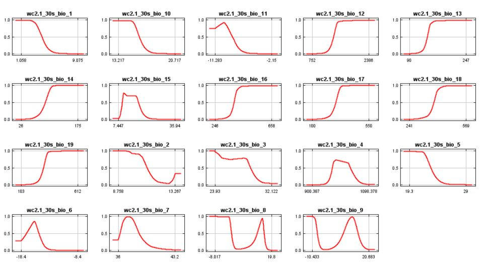

# Species Distribution Modeling of Bicknell's Thrush in VT and NH using Maxent
### A Tutorial for Data Preparation | Mitchell Lazarz | 07 December 2020 | ID30274 Final Project

This repo contains this README explaining the steps for data preparation for the Maxent software for modeling species niche and distribution.  This README will walk the user through the steps of software download, data download, local drive preparation, python codes for data preparation, running of the Maxent software, as well as a short analysis of outputs.  A .py script, a .csv table of species occurrence, and a study area mask shapefile used in this tutorial and contained in this repo.

## What is Maxent?  And why use Maxent?

[Maxent](https://biodiversityinformatics.amnh.org/open_source/maxent/) is an open-source software that utilizes a machine learning algorithm in order to model species distribution based on species occurrence records and a set of climate variables.  The software extracts values at species occurrence coordinates from the series of climate grids and projects the distribution by comparing to a set of randomly selected points used as psedo-absence records.  The algorithm is based on the maximum entropy theory that estimates the greatest probability based on our current understanding of the distribution and attributes of our input records.  More information about the statistics behind this software can be found here [(Elith et. al 2010).](https://web.stanford.edu/~hastie/Papers/maxent_explained.pdf)  The Maxent approach of species distribution modeling is a widely accepted method in the ecological modeling community.  As of 2006, the Maxent software has been cited over [6000 times](https://onlinelibrary.wiley.com/doi/full/10.1111/ecog.03049) for use in ecological studies in Google Scholar (Philips et. al 2017).

The Maxent software is beneficial for conservation and land management agencies with a limited budget.  Because Maxent is open-source, it is available for use to the public for no cost.  This software is relatively simple to use and the output report gives clear explanations of the findings of the model.  Because it is so widely used, there are many additional resources for result interpretation.  A set of resources from one of the creators, Robert Anderson, can be found [here.](https://www.andersonlab.ccny.cuny.edu/resources)

## Tutorial Summary


In this tutorial, we will be modeling the species distribution of the Bicknell's Thrush (*Catharus bicknelli*) in Vermont and New Hampshire using species occurrence records from 2010 to 2019 and climate information from 1970 to 2000.  The [Bicknell's Thrush](https://vtecostudies.org/wildlife/birds/mountain-birds/bicknells-thrush-2/) is one of the rarest songbird in the Eastern United States with severe population vulnerability due to habitat loss from development and climate related factors.  We will be modeling distribution of the Bicknell's Thrush in Vermont and New Hampshire as the bird's summer breeding ground in is the high elevation boreal forests of the White Mountains and Green Mountains where Bicknell's Thrush habitat conservation is a priority.

## Software Needed

In this tutorial, the user will need: 
1. Maxent species modeler application 
2. A Python IDLE (I used [IDLE (Python GUI) 2.7.16](https://www.python.org/downloads/)) 
3. ArcGIS Map or Pro with spatial analyst extension

To download Maxent, go to [this site](https://biodiversityinformatics.amnh.org/open_source/maxent/) and download the latest version.  Unzip folder contents onto your computer's hard drive; I unzipped to my Program Files.  To open the Maxent modeler (you do not need to do this now), open the maxent executable .jar file within the folder.

## Data

In this tutorial we will be using three sets of data:
1. A .csv of species occurrence records
2. A study area mask
3. A set of climate variables downloaded as GEOTIFFs

#### Species Occurrence .csv
Found in this repo is a .csv of Bicknell's Thrush sightings from 2010 to 2019.  This .csv was accessed from the [Global Biodiversity Information Facility](https://www.gbif.org/).  The Global Biodiveristy Information Facility database contains species records from over 54,000 species.  If you would like to model distribution for a different species in the future, GBIF.org has a [user-friendly interface](https://www.gbif.org/occurrence/search) for querying for your species of interest and timeframe.  The .csv within this repo is a raw dataset of Bicknell's Thrush sighting that contains over 40 fields.

#### Study Area Mask
The StudyAreaMask folder in this repo contains a shapefile of Vermont and New Hampshire, our area of interest.  This shapefile was accessed from [TIGER U.S. Census States, 2018](https://www.census.gov/geographies/mapping-files/time-series/geo/tiger-line-file.html).   

#### Climate Variables
The set of climate variables used in this tutorial are the WorldClim Bio Variables Version 2.1.  This is a set of 19 historic bioclimatic variables ranging from average/minimum/maximum temperature, annual/monthly/quarterly precipitation, and seasonal weather variables from years 1970 to 2000.  These variables are downloaded in GEOTIFF format.  A list of these variables can be seen below:


To access this dataset, go to the [WorldClim website download page](https://www.worldclim.org/data/worldclim21.html).  Within the table containing "Bioclimatic variables", select bio30s or click [here](https://biogeo.ucdavis.edu/data/worldclim/v2.1/base/wc2.1_30s_bio.zip) to download.  This is at a 30 second spatial resolution and the folder is large, 9.68 GB.  If you would like to try this tutorial using a smaller dataset with a larger spatial resolution, one can use the bio 10 minute or bio 5 minute datasets. If you would like to create a model of global distribution of a species, I would suggest using the bio 5 or 10 minute dataset and skipping the masking steps in the python script.

## Getting Started

First we must set up our data folder with all data needed in this tutorial.  Create a "Data" folder and download/unzip the BicknellThrush.csv, NHVT shapefile files, and WorldClim GEOTIFFs to this folder.  Your Data folder environment should look something like this:


## Data Manipulation Python Code

Next, open your Python IDLE to beginning writing code to do two operations:
1. Manipulate the input .csv to have three fields:  Species, Latitude, and Longitude
2. Mask the bioclimatic GEOTIFFs to our NHVT shapefile study area and convert the masked variables from GEOTIFF to .asc format.

You may want reference the python script, MaxentTutorial.py, within this repo to see this process.  The following is the workflow of the entire process and the following sections will walk you through this flow step by step:


### Cleaning the BicknellThrush.csv

The Maxent software only allows for a input of species occurrence records with the three fields mentioned earlier.  We will write a script to convert the raw .csv to a .csv containing three fields.

First, the csv module is imported.
```
# import csv module
import csv
```
Next, the BicknellThrush.csv is opened and assigned to a variable, Bicknell_Thrush.
```
# open and assign raw .csv file to variable
Bicknell_Thrush=open('C:\CLARK\MaxentTutorial\Data\BicknellThrush.csv')
```
Then, we create a file location for the output .csv. Here we choose the same Data folder for our output and name the new .csv with three fields, Observations.csv.
```
# create writable file location for output .csv
outputFile=open('C:\CLARK\MaxentTutorial\Data\Observations.csv','w')
```
Lastly, a *for loop* is created which, for each row in our input .csv, splits the fields in an occurrence of a tab.  The fields for species, latitude and longitude are assigned to variables and then are renamed.  The output is then written to our output .csv file location.
```
# for loop which creates a .csv with three columns, Species, Latitude, Longitude
for row in Bicknell_Thrush:
  obs=row.split('\t')
  species=obs[9]
  lat=obs[21]
  lon=obs[22]
  lat=lat.replace('decimalLatitude','Latitude')
  lon=lon.replace('decimalLongitude','Longitude')
  outputFile.write(species+', '+lat+', '+lon+'\n')
```
We can see by opening our output .csv, Observations.csv, that we now have a file with only three fields, species, latitude, and longitude.


### Masking and converting the Bioclimatic variables to .asc format

In order to analyze on a scale that only incorporates Vermont and New Hampshire rather than at a global scale, we must mask our climate variables to the NHVT shapefile.  Additionally, the Maxent software does not read the GEOTIFF format, but rather the text-based ASCII (.asc) format.  After masking, we will convert the GEOTIFFs to .asc.

First, we must import all of the modules needed for this operation.  These include arcpy, the spatial analyst extension of arcpy, and the operating system interface (os).
```
# import arcpy module, workspace environment, and spatial analyst extension
import arcpy
from arcpy import env
from arcpy.sa import *

# import operating system module
import os
```
Next, we will organize the names of GEOTIFF files within the Data folder into a list.  We do this in order to easily call and loop through the 19 .tif files with ease during our masking and .asc conversion operations.  An empty list, ClimateVariableList, is created to hold our file names and the Data folder is looped through, taking the file name of each climate .tif and adding it to the empty list.  We can then print the ClimateVariableList to ensure that it contains 19 elements.
```
# create empty list for climate file names
ClimateVariableList=[]

# loops through climate folder and adds file name to empty list
ClimateFolder = r'C:\\CLARK\\MaxentTutorial\\Data\\'
for filename in os.listdir(ClimateFolder):
    if filename.endswith(".tif"):
        ClimateVariableList.append(filename)
print(ClimateVariableList)
```
We then set the workspace environment to our Data folder, set the overwrite privileges as 'True' (we want only one climate .asc for each variable when we run Maxent), and check out the spatial analyst extension.
```
# Set environment settings to folder with climate data and allow for overwriting
env.workspace = 'C:\\CLARK\\MaxentTutorial\\Data'
env.overwriteOutput = True
arcpy.CheckOutExtension("Spatial") #check out spatial analyst extension
```
After setting our environment, we create a *for loop* which masks each input GEOTIFF to the NHVT shapefile.  The output is saved by overwriting the non-masked input.
```
# loop through list of file names and mask climate variables to study area mask
for file in ClimateVariableList:
  # Set local variables
  inRaster = file
  inMaskData = "C:\CLARK\MaxentTutorial\Data\NHVT.shp"

  # Execute ExtractByMask
  outExtractByMask = ExtractByMask(inRaster, inMaskData)

  # Save the output 
  outExtractByMask.save(file)
```
We then create a second *for loop* which converts the masked GEOTIFFs to the .asc format using the arcpy spatial analyst extension RastertoASCII_conversion function.  The file is saved after removing the '.tif' file extension and adding '.asc'.
```
# loop through list of file names and convert .tif to .asc
for file in ClimateVariableList:
    # Set local variables
    inRaster = file
    outASCII = 'C:\\CLARK\\MaxentTutorial\\Data\\'+file[:-4]+".asc"
    # Execute RasterToASCII
    arcpy.RasterToASCII_conversion(inRaster, outASCII)
```

After this final step, we now have 19 .asc files for all of our input bioclimatic variables.

### Running Maxent

We are now ready to run the Maxent species distribution modeler.  Open the Maxent.jar Java application from wherever you saved it during download.

The following shows the Maxent application interface and the required inputs:


1.  In the Sample file dropdown, select our cleaned species occurrence .csv, Observations.csv.
2.  In the Environmental Layers directory dropdown, select the Data folder containing our masked .asc files.  When selecting the Data folder, the 19 bioclimatic .asc files will appear.  Ensure that all files are selected and labeled as 'continuous' variables rather than 'categorical'.
3.  Select the desired outputs of running the model.  'Create response curve' will include response curves for each variable and how they relate to the predicted distribution.  'Make picture of predictions' will include a map of the distribution surface in the output report. 'Do jackknife to measure variable importance' will produce an output graph comparing climatic variable importance to each other variable and how they contribute to the model.  Ensure that the output format is 'Cloglog' and the output file type is '.asc'.
4.  Select the output directory.  I selected the folder housing the Data folder.  Also, select the projection layers directory as the Data folder.  This is done because our projection files are within this folder after running the RastertoASCII function.
5.  Lastly run the model.  There are advanced settings if you would like to explore more options.  To learn more about these options follow this [link](http://www.amnh.org/content/download/141371/2285439/file/LinC3_SpeciesDistModeling_Ex.pdf) to download a tutorial that focuses more on the setup and outputs of Maxent.

When running Maxent, you will receive a popup stating that some of the input records do not have climate variables associated with them.  This is because we did not query the species records to the study area.  Select 'ignore all' as these records will not disregarded in our analysis.

### Results and analysis

After running the application, the output will be located in the directory that was selected.  The following is a brief explanation of the output report:

#### Area under the curve (AUC) graph

The AUC graph shows the models fit and significance.  In our model, we see that our AUC is equal to 0.946 compared to the null hypothesis (representing a random model) of 0.5.  A model with a perfect fit would have an AUC of 1.0 and the closer to 1.0 a model falls, the more significant the results.  Here we see that we have high significance of our findings:


#### Distribution map

The next output is the report map showing the distribution surface and input training coordinates from our .csv file of Bicknell's Thrush.  The white squares are the coordinates of occurrence and the cooler colors indicate lesser suitable habitat and the warm colors indicate higher suitable habitat.  This prediction of distribution is on a 0 to 1 scale.  Knowing the geography of Vermont and New Hampshire helps with interpretation of this figure.  We see that the highly suitable habitat is in the alpine areas of the White Mountain in New Hampshire and the Green Mountains in Vermont.  The next main section will show how to import the output .asc file into ArcGIS for cleaner display and gives the user the ability to investigate the spatial distribution of suitable habitat.


#### Variable importance

The next output is a table of variable importance.  Each variable is shown as a percentage of contribution to the model as well as the importance of the variable as it relates to the random, psedo-absence values, in permutation importance.  We can see that in this model that the most important variables for predicting the Bicknell's Thrush distribution are variables bio05, max temperature in the warmest month, and bio18, precipitation in the warmest quarter.


#### Further investigation of variables

By selecting 'create response curves', in Step 4 of our running of Maxent, we can see how the exactly the climate variables respond to our model.  Let us take a look at bio05 and bio18 as they are the variables that contributed the most to our model.  For bio05, the max temperature in the warmest month, we see that the graph nears 1 (high suitability) at the lowest temperature and 0 (low suitability) at the highest temperature.  For bio18, precipitation in the warmest quarter, we see the graph near 1 at high precipitation and 0 at low precipitation.  Although we should not make any definite conclusions from this, it is logical to think that the Bicknell's Thrush prefers low temperatures and high precipitation during the summer months.  This makes sense as the Bicknell's Thrush breeds in high alpine areas during the summers in New England.  The following shows the response curves of our bioclimatic variables:



### Importing output prediction .asc surface into ArcGIS

We can create a cleaner map of our distribution prediction of the Bicknell's Thrush by importing the output .asc into ArcGIS.  Before doing this we must make a correct the projection file (.prj) that is associated with our output, Catharus_Bicknelli.asc.  In the directory containing the prediction surface .asc file, Catharus_Bicknelli.asc, there is a blank .prj file.  Manually rename this file to Catharus_Bicknelli.prj.  The following is a screenshot showing the output folder containing the unlabeled projection file:


After renaming the projection file, open a new map in any version of ArcGIS (I used ArcGIS Pro).  Create a folder connection to the folder containing the Catharus_Bicknelli.asc file.  Drag the .asc file into the mapframe and the surface will appear correctly projected.  Furthermore, you can use the XY to Point tool to display the occurrence records using the Observations.csv file.  Change the symbology however you see fit to cleanly display the data.  The following is a map product created in ArcGIS using the .asc output and displaying the Bicknell's Thrush occurrence points.


### Conclusion

As shown in this tutorial, Maxent is a relatively easy to use open-source software for species distribution modeling.  Additionally, the output report, files, and graphs can be easily interpreted and used to create aesthetically pleasing maps in ArcGIS.  This software has great capabilities to streamline modeling of vulnerable species for conservation organizations and land management agencies during a time where a changing climate and development is impacting global biodiversity.  

I hope that this tutorial has enhanced your knowledge of the software, data acquisition and preprocessing in order to obtain powerful results.  Moving forward, I would like to create a workflow that only utilizes open source software for data preparation and visualization.

### Citations

Anderson Lab [online], 2020. andersonlab. Available from: https://www.andersonlab.ccny.cuny.edu/resources.

Bicknell’s Thrush [online], 2020. Vermont Center for Ecostudies. Available from: https://vtecostudies.org/wildlife/birds/mountain-birds/bicknells-thrush-2/.

Elith, J., Phillips, S.J., Hastie, T., Dudík, M., Chee, Y.E., and Yates, C.J., 2011. A statistical explanation of MaxEnt for ecologists: Statistical explanation of MaxEnt. Diversity and Distributions, 17 (1), 43–57. https://web.stanford.edu/~hastie/Papers/maxent_explained.pdf

Esri Inc. (2019). ArcGIS Pro (Version 2.4.2). Esri Inc. https://www.esri.com/en-us/arcgis/products/arcgis-pro/.

Fick, S.E. and R.J. Hijmans, 2017. WorldClim 2: new 1km spatial resolution climate surfaces for global land areas. International Journal of Climatology 37 (12): 4302-4315.  Available from: https://www.worldclim.org/data/worldclim21.html.

Global Biodiversity Information Facility [online], 2020. Available from: https://www.gbif.org/occurrence/search.

Merow, C., Smith, M.J., and Silander, J.A., 2013. A practical guide to MaxEnt for modeling species’ distributions: what it does, and why inputs and settings matter. Ecography, 36 (10), 1058–1069.  Available from:  https://onlinelibrary.wiley.com/doi/pdf/10.1111/j.1600-0587.2013.07872.x.

Phillips, S.J., Anderson, R.P., Dudík, M., Schapire, R.E., and Blair, M.E., 2017. Opening the black box: an open-source release of Maxent. Ecography, 40 (7), 887–893. Available from: https://onlinelibrary.wiley.com/doi/full/10.1111/ecog.03049.

Philips, S.J., Dudík, M., and Schapire, R.E. [Internet] Maxent software for modeling species niches and distributions (Version 3.4.1) Available from url: https://biodiversityinformatics.amnh.org/open_source/maxent/
